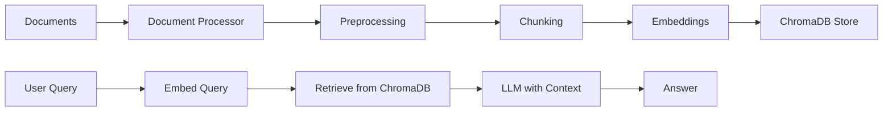

```mermaid
graph LR
    A[Documents] --> B[Document Processor]
    B --> C[Preprocessing]
    C --> D[Chunking]
    D --> E[Embeddings]
    E --> F[ChromaDB Store]
    
    G[User Query] --> H[Embed Query]
    H --> I[Retrieve from ChromaDB]
    I --> J[LLM with Context]
    J --> K[Answer]

```
