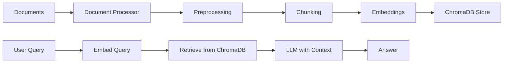

## current step
- chunking
- embedding_manager
- 

"""
Embedding generation using SentenceTransformers.
"""

import logging
from typing import List, Optional
import numpy as np
from sentence_transformers import SentenceTransformer

logger = logging.getLogger(__name__)

class EmbeddingManager:
    """Handles document embedding generation."""
    
    def __init__(self, model_name: str = "all-MiniLM-L6-v2"):
        self.model_name = model_name
        self.model: Optional[SentenceTransformer] = None
        self._load_model()
    
    def _load_model(self) -> None:
        """Load the SentenceTransformer model."""
        try:
            logger.info(f"Loading embedding model: {self.model_name}")
            self.model = SentenceTransformer(self.model_name)
            logger.info(
                f"Model loaded. Dimension: {self.model.get_embedding_dimension()}"
            )
        except Exception as e:
            logger.error(f"Error loading model: {e}")
            raise
    
    def generate_embeddings(self, texts: List[str]) -> np.ndarray:
        """Generate embeddings for a list of texts."""
        if not self.model:
            raise ValueError("Model not loaded")
        
        logger.info(f"Generating embeddings for {len(texts)} texts")
        embeddings = self.model.encode(texts, show_progress_bar=True)
        return embeddings
    
    def get_dimension(self) -> int:
        """Get the embedding dimension."""
        if not self.model:
            raise ValueError("Model not loaded")
        return self.model.get_embedding_dimension()

# ============= main.py ===============
"""
RAG Agent CLI - Main entry point.
"""

import click
import logging
from pathlib import Path

# Setup logging ONCE
logging.basicConfig(
    level=logging.INFO,
    format='%(asctime)s - %(name)s - %(levelname)s - %(message)s',
    datefmt='%H:%M:%S'
)

logger = logging.getLogger(__name__)

@click.group()
def cli():
    """RAG Agent - Your personal RAG assistant."""
    logger.info("🚀 RAG Agent started")

@cli.command()
@click.option(
    '--path', '-p',
    type=click.Path(exists=True, file_okay=True, dir_okay=True, readable=True),
    help='Path to file or directory (default: ./data)'
)
@click.option(
    '--chunk-size',
    type=int,
    default=1000,
    help='Chunk size for splitting'
)
@click.option(
    '--chunk-overlap',
    type=int,
    default=200,
    help='Chunk overlap'
)
def ingest(path: Optional[str] = None, chunk_size: int = 1000, chunk_overlap: int = 200):
    """
    Ingest documents into the vector store.
    
    Steps:
        1. Load documents (PDF, CSV, TXT)
        2. Preprocess (clean text, extract metadata)
        3. Chunk into pieces
        4. Generate embeddings
        5. Store in ChromaDB
    """
    logger.info("📂 Starting document ingestion...")
    
    try:
        from rag_agent.core.document_processor import DocumentProcessor
        from rag_agent.core.embedding_manager import EmbeddingManager
        from rag_agent.core.vector_store import VectorStore
        
        # Step 1: Process documents
        logger.info("Step 1/5: Loading and processing documents...")
        processor = DocumentProcessor(
            chunk_size=chunk_size,
            chunk_overlap=chunk_overlap,
        )
        
        source_path = path if path else processor.data_dir
        chunks = processor.process(source_path=source_path)
        
        if not chunks:
            logger.warning("⚠️  No documents found to process!")
            logger.info("💡 Place files in ./data/ or use --path")
            return
        
        stats = processor.get_stats()
        logger.info(f"✅ Loaded {len(chunks)} chunks from {stats['pages_processed']} pages")
        
        # Step 2: Generate embeddings
        logger.info("Step 2/5: Generating embeddings...")
        embedder = EmbeddingManager()
        texts = [doc.page_content for doc in chunks]
        embeddings = embedder.generate_embeddings(texts)
        logger.info(f"✅ Generated {embeddings.shape[0]} embeddings")
        
        # Step 3: Store in vector database
        logger.info("Step 3/5: Storing in vector database...")
        store = VectorStore()
        store.add_documents(chunks, embeddings)
        logger.info(f"✅ Stored {store.count()} documents in vector DB")
        
        # Show summary
        click.echo("\n📊 Ingestion Summary:")
        click.echo(f"  Files processed: {stats['files_processed']}")
        click.echo(f"  Pages/rows: {stats['pages_processed']}")
        click.echo(f"  Chunks created: {stats['chunks_created']}")
        click.echo(f"  Duplicates skipped: {stats['duplicates_skipped']}")
        click.echo(f"  Vector DB: {store.count()} documents")
        
        logger.info("🎉 Ingestion complete!")
        
    except Exception as e:
        logger.error(f"❌ Ingestion failed: {e}")
        raise

@cli.command()
@click.option('--query', '-q', help='Ask a question')
@click.option('--interactive', '-i', is_flag=True, help='Interactive mode')
def chat(query, interactive):
    """Chat with your documents."""
    logger.info("💬 Starting chat session")
    # We'll implement this next!
    click.echo("Chat coming soon! Use --query or --interactive")

@cli.command()
def status():
    """Show the status of the RAG agent."""
    logger.info("📊 Checking status...")
    
    from rag_agent.core.vector_store import VectorStore
    from rag_agent.config.settings import settings
    
    # Check vector store
    try:
        store = VectorStore()
        count = store.count()
        click.echo(f"✅ Vector store: {count} documents")
    except Exception as e:
        click.echo(f"❌ Vector store: Not initialized ({e})")
    
    # Check data directory
    data_path = Path(settings.data_dir)
    if data_path.exists():
        click.echo(f"✅ Data directory: {data_path}")
    else:
        click.echo(f"❌ Data directory: {data_path} not found")
    
    # Check embedding model
    from rag_agent.core.embedding_manager import EmbeddingManager
    embedder = EmbeddingManager()
    click.echo(f"✅ Embedding model: {embedder.model_name} (dim: {embedder.get_dimension()})")

@cli.command()
def version():
    """Show version information."""
    from rag_agent import __version__
    click.echo(f"RAG Agent v{__version__}")

if __name__ == "__main__":
    cli()
